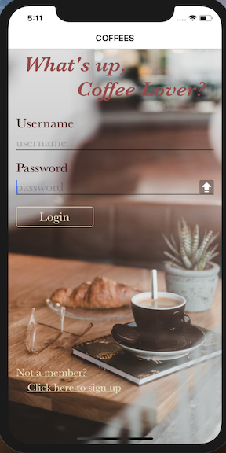

# CoffeeS
A coffee shops finding/recommendation app that knows you well, which also serves as a platform for coffee lovers to find their communities and learn more about coffee. :heart:


<p align="center">
  
</p>


## Backstory
I am a huge coffee lover, but I find myself stop trying new coffee shops once I know a good one in the city. Also, I seldom meet people who are crazy about coffee as I do. So here comes CoffeeS, my problem solver.  :coffee:


## Features
- Questionary upon registering that collects data from users. :notebook:

  


- Main page shows your location and help you find coffee shops near you: :star:

  - "Stick to my habits" mode shows all your frequent coffee shops nearby. 
  
    
  
  
  - "Try something new" mode recommends you coffee shops you don't frequent according to your coffee profile. 
  
  

 
 
 
- Classroom page is where you can find article resources about coffee. :school:

  
  


- Community page is where you can post reviews about a coffee shop. You can also read, like, or save other people's reviews so you can visit those coffee shops later. :wink:

  


## Technologies Used
- Front end developed with React Native using Expo.
- Backend written in javascript. Applied Express to set up the server.
- Using MongoDB as database.
- Applied GoogleMap API to serch for places around a certain location on the map.


## Build

To build and run this application locally, you'll need to:
1. clone this repository.
2. change directory to this repository.
3. run the following commands in terminal:

```
 cd server/
 npm install --save
 npm start
 cd ..
 cd client/
 npm install --save
 npm start


```

